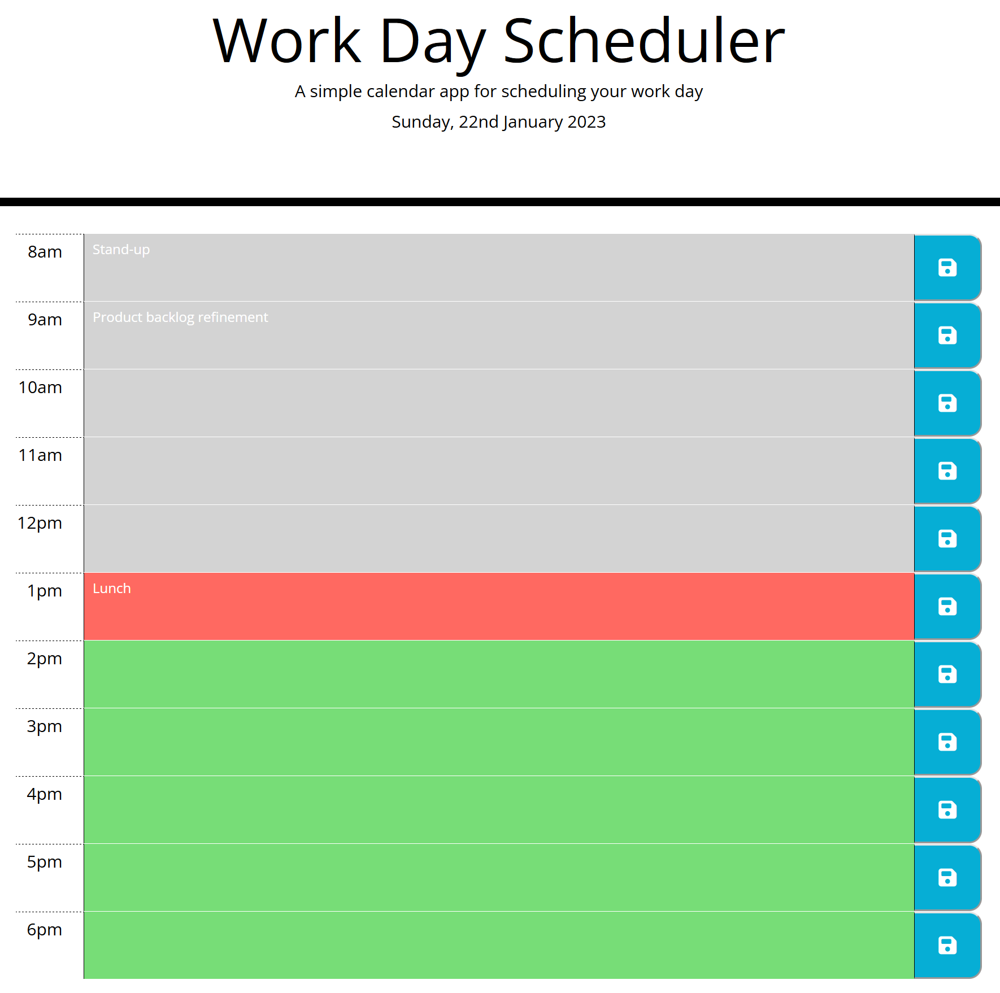

# Work day scheduler

## Description

Build an app with the following functionality:
- Display the current day at the top of the calender when a user opens the scheduler.
- Show time blocks for standard business hours.
- Color-code each time block based on if it is in the past, the present or the future when the scheduler is viewed.
- Allow a user to enter an event when they click a time block.
- Allow a user to save the event in local storage when the save button is clicked in that time block.
- Saved events should be persisted between page refreshes.

## Usage

The live site can be found here, [https://fezzer.github.io/work-day-scheduler/](https://fezzer.github.io/work-day-scheduler/).

To use the application, click on a time block and type the event. To save the event, click the save button.

## License

Please refer to the license in the repo.